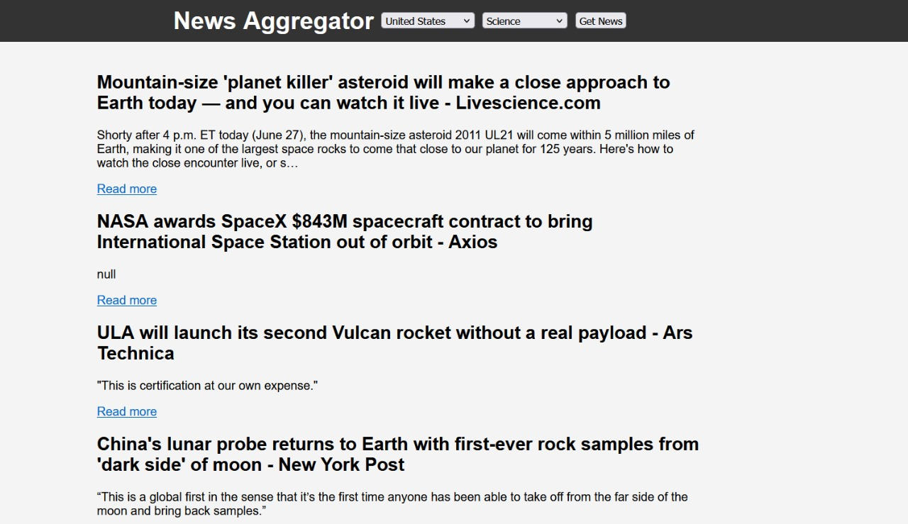

# News Aggregator

## Introduction

The News Aggregator is a web application that allows users to search for news articles from various sources based on a country and category. The app fetches and displays relevant news articles using the News API. 

## Features

- **Search Functionality**: Users can input a search query to find news articles related to the keyword.
- **Display Results**: The app displays the title, description, and a link to read more for each article.
- **Error Handling**: The app handles errors and displays appropriate messages if no articles are found or if there's an issue with the API request.

## Usage

1. Enter a search query in the input field.
2. Click the "Search News" button to fetch and display news articles related to the query.
3. Read more will redirect to the news website.
4. The news API on developer mode works only for local host therefore its required to be run on local host not on browser
## Here is the Example Usage on Local Host

## API Key

The app uses the News API which requires an API key. You can obtain a free API key from [News API](https://newsapi.org/). 
